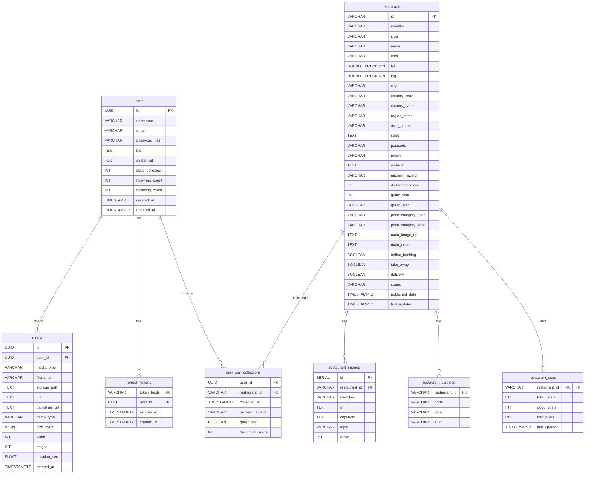

# HackMichelin — Database Schemas

## Overview

| Store | Purpose |
|---|---|
| **PostgreSQL** | Users, restaurants (Michelin data), media metadata, auth tokens, star collections, stats |
| **Cassandra** | Posts, likes, comments, feed, social graph |
| **Elasticsearch** | Full-text + geo search *(schema not in this file)* |

---

## PostgreSQL

### Entity-Relationship Diagram



### Table Details

#### `users` — owned by LoginService / UserService
| Column | Type | Notes |
|---|---|---|
| `id` | UUID PK | auto `gen_random_uuid()` |
| `username` | VARCHAR(50) | unique |
| `email` | VARCHAR(255) | unique |
| `password_hash` | VARCHAR(255) | |
| `bio` | TEXT | |
| `avatar_url` | TEXT | |
| `stars_collected` | INT | denormalized counter, updated by UserService |
| `followers_count` | INT | denormalized counter |
| `following_count` | INT | denormalized counter |
| `created_at` / `updated_at` | TIMESTAMPTZ | |

#### `restaurants` — owned by MapsDataService (read-only after import)
| Column | Type | Notes |
|---|---|---|
| `id` | VARCHAR(50) PK | objectID from Michelin dataset |
| `identifier` / `slug` | VARCHAR | unique |
| `name` | VARCHAR(255) | |
| `chef` | VARCHAR(255) | |
| `lat` / `lng` | DOUBLE PRECISION | geo coordinates |
| `city`, `country_code`, `region_name`, `area_name` | VARCHAR | location hierarchy |
| `michelin_award` | VARCHAR(50) | `THREE_STARS` \| `TWO_STARS` \| `ONE_STAR` \| null |
| `distinction_score` | INT | |
| `guide_year` | INT | indexed |
| `green_star` | BOOLEAN | partial index where `true` |
| `price_category_code` / `label` | VARCHAR | |
| `online_booking`, `take_away`, `delivery` | BOOLEAN | |

> **Indexes:** `city`, `country_code`, `michelin_award`, `guide_year`, `green_star` (partial)

#### `restaurant_images`
| Column | Type | Notes |
|---|---|---|
| `id` | SERIAL PK | |
| `restaurant_id` | VARCHAR(50) FK | → `restaurants.id`, CASCADE delete |
| `url` | TEXT | |
| `topic` | VARCHAR(50) | e.g. `SUJ_PLAT`, `SUJ_INT`, `SUJ_ENT`, `SUJ_EXT` |
| `order` | INT | display order |

#### `restaurant_cuisines`
| Column | Type | Notes |
|---|---|---|
| `restaurant_id` | VARCHAR FK | composite PK |
| `code` | VARCHAR(50) | composite PK |
| `label` / `slug` | VARCHAR | |

#### `media` — owned by UploadService
| Column | Type | Notes |
|---|---|---|
| `id` | UUID PK | |
| `user_id` | UUID FK | → `users.id`, CASCADE delete |
| `media_type` | VARCHAR(10) | `photo` \| `video` (CHECK constraint) |
| `filename` | VARCHAR(255) | |
| `storage_path` | TEXT | absolute path `/media/{uuid}.{ext}` |
| `url` | TEXT | `/api/download/files/{filename}` |
| `thumbnail_url` | TEXT | null for photos; ffmpeg-generated for videos |
| `mime_type` | VARCHAR(100) | |
| `size_bytes` | BIGINT | |
| `width` / `height` | INT | |
| `duration_sec` | FLOAT | null for photos |

#### `refresh_tokens` — owned by LoginService
| Column | Type | Notes |
|---|---|---|
| `token_hash` | VARCHAR(64) PK | SHA-256 hex of raw random token |
| `user_id` | UUID FK | → `users.id`, CASCADE delete |
| `expires_at` | TIMESTAMPTZ | 30-day lifetime; purge with `DELETE WHERE expires_at < NOW()` |

#### `user_star_collections` — owned by UserService
| Column | Type | Notes |
|---|---|---|
| `user_id` | UUID FK | composite PK |
| `restaurant_id` | VARCHAR FK | composite PK — prevents duplicate collection |
| `collected_at` | TIMESTAMPTZ | |
| `michelin_award` | VARCHAR(50) | **snapshot** at collection time |
| `green_star` | BOOLEAN | snapshot |
| `distinction_score` | INT | snapshot |

#### `restaurant_stats` — owned by StatsService (async via MQTT)
| Column | Type | Notes |
|---|---|---|
| `restaurant_id` | VARCHAR PK FK | → `restaurants.id` |
| `total_posts` | INT | |
| `good_posts` | INT | |
| `bad_posts` | INT | |
| `last_updated` | TIMESTAMPTZ | |

> `good_pct` is computed at query time: `good_posts::float / NULLIF(total_posts, 0)`

---

## Cassandra — Keyspace `hackmichelin`

> **Design rule:** one table per access pattern — no joins. Every post table carries `rating` (`GOOD` | `BAD`) to avoid cross-store lookups.

### Access-Pattern Map

```
posts               → lookup by (user_id, created_at, post_id); by post_id alone needs ALLOW FILTERING
user_posts          → profile page  : all posts by user X, newest first
restaurant_posts    → restaurant page: all posts tagged to restaurant X
post_likes          → who liked post X / has user Y liked it?
post_likes_count    → like count for post X (counter table)
post_comments       → comment thread for post X, oldest first
user_feed           → personal feed for viewer X, newest first (TTL 30 days)
user_following      → who does user X follow?     (FeedService fan-out)
user_followers      → who follows user X?         (profile followers list)
```

### Table Details

#### `posts` — partition: `user_id`, cluster: `created_at DESC, post_id ASC`

> **Note:** live DB schema differs from `init/cassandra/init.cql`. Columns `media_id` and `rating` are absent from the live table. Use `DESCRIBE TABLE hackmichelin.posts` as the source of truth.

```cql
PRIMARY KEY (user_id, created_at, post_id)
CLUSTERING ORDER BY (created_at DESC, post_id ASC)
```

| Column | Type | Notes |
|---|---|---|
| `user_id` | uuid (partition key) | |
| `created_at` | timestamp (cluster) | |
| `post_id` | uuid (cluster) | |
| `username` | text | |
| `restaurant_id` | text | FK → PostgreSQL `restaurants.id` |
| `restaurant_name` | text | denormalized |
| `media_type` | text | `photo` \| `video` |
| `media_url` / `thumbnail_url` | text | |
| `caption` | text | |

> Lookup by `post_id` alone requires `ALLOW FILTERING` (full partition scan). To look up efficiently, always provide `user_id + created_at + post_id`.

#### `user_posts` — partition: `user_id`, cluster: `created_at DESC, post_id ASC`
| Column | Type |
|---|---|
| `user_id` | uuid (partition) |
| `created_at` | timestamp (cluster) |
| `post_id` | uuid (cluster) |
| `restaurant_id` / `restaurant_name` | text |
| `media_type` / `media_url` / `thumbnail_url` | text |
| `caption` / `rating` | text |

#### `restaurant_posts` — partition: `restaurant_id`, cluster: `created_at DESC, post_id ASC`
| Column | Type |
|---|---|
| `restaurant_id` | text (partition) |
| `created_at` | timestamp (cluster) |
| `post_id` | uuid (cluster) |
| `user_id` / `username` | uuid / text |
| `media_type` / `media_url` / `thumbnail_url` | text |
| `caption` / `rating` | text |

#### `post_likes` — partition: `post_id`, cluster: `user_id`
| Column | Type | Notes |
|---|---|---|
| `post_id` | uuid (partition) | |
| `user_id` | uuid (cluster) | enables existence check without full scan |
| `username` | text | |
| `liked_at` | timestamp | |

#### `post_likes_count` — partition: `post_id`
| Column | Type | Notes |
|---|---|---|
| `post_id` | uuid PK | |
| `likes` | counter | atomic inc/dec by LikeService |

#### `post_comments` — partition: `post_id`, cluster: `created_at ASC, comment_id ASC`
| Column | Type | Notes |
|---|---|---|
| `post_id` | uuid (partition) | |
| `created_at` | timestamp (cluster) | pagination cursor |
| `comment_id` | uuid (cluster) | |
| `user_id` / `username` | uuid / text | |
| `body` | text | |

#### `user_feed` — partition: `viewer_id`, cluster: `created_at DESC, post_id ASC` · TTL 30 days
| Column | Type | Notes |
|---|---|---|
| `viewer_id` | uuid (partition) | one row per follower per post |
| `created_at` | timestamp (cluster) | pagination cursor |
| `post_id` | uuid (cluster) | |
| `author_id` / `author_name` | uuid / text | |
| `restaurant_id` / `restaurant_name` | text | |
| `media_type` / `media_url` / `thumbnail_url` | text | |
| `caption` / `rating` | text | |

> Rows expire automatically after **2 592 000 s (30 days)**. Populated by FeedService fan-out on `post.created` MQTT events.

#### `user_following` — partition: `follower_id`
| Column | Type | Notes |
|---|---|---|
| `follower_id` | uuid (partition) | "who does X follow?" |
| `followed_id` | uuid (cluster) | |
| `followed_name` | text | |
| `followed_at` | timestamp | |

#### `user_followers` — partition: `followed_id`
| Column | Type | Notes |
|---|---|---|
| `followed_id` | uuid (partition) | "who follows X?" |
| `follower_id` | uuid (cluster) | |
| `follower_name` | text | |
| `followed_at` | timestamp | |

> `user_following` and `user_followers` are two sides of the same follow edge, written atomically by UserService on follow/unfollow.

---

## Service → Store Ownership

| Service | PostgreSQL | Cassandra |
|---|---|---|
| **LoginService** | `users` (write), `refresh_tokens` | — |
| **UserService** | `users` (counters) | `user_following`, `user_followers` |
| **UploadService** | `media` | — |
| **PostService** | — | `posts`, `user_posts`, `restaurant_posts` |
| **LikeService** | — | `post_likes`, `post_likes_count` |
| **CommentService** | — | `post_comments` |
| **FeedService** | — | `user_feed` |
| **StatsService** | `restaurant_stats` (via MQTT) | — |
| **MapsDataService** | `restaurants`, `restaurant_stats` (read) | — |
